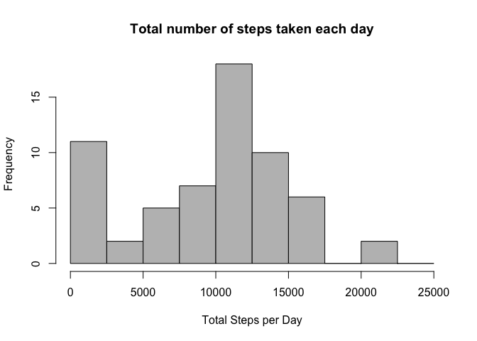
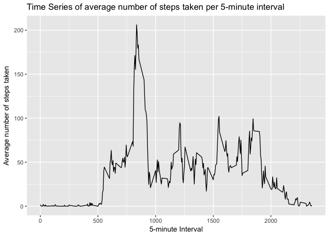
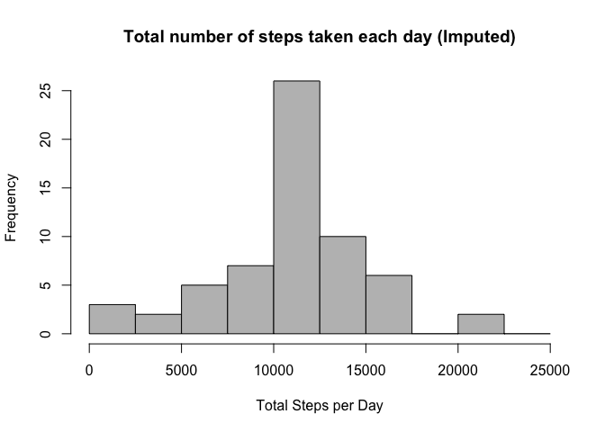
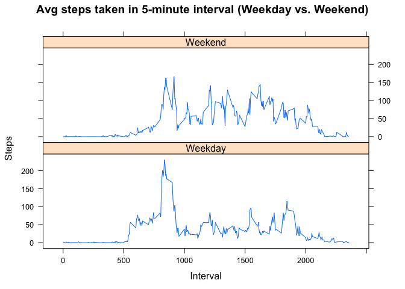

# Reproducible Research: Course Project 1
SHUO FENG  
29/01/2017  


### About
**Reproducible Research** (one of Data Science Specialization courses) Course Project 1 makes use of data from a personal activity monitoring device. This device collects data at 5 minute intervals through out the day. The data consists of two months of data from an anonymous individual collected during the months of October and November, 2012 and include the number of steps taken in 5 minute intervals each day.

### Data
The data for this assignment can be downloaded from the course web site:

Dataset: [Activity monitoring data](https://d396qusza40orc.cloudfront.net/repdata%2Fdata%2Factivity.zip) [52K]

The variables included in this dataset are:

* **steps**: Number of steps taking in a 5-minute interval (missing values are coded as `NA`)

* **date**: The date on which the measurement was taken in YYYY-MM-DD format

* **interval**: Identifier for the 5-minute interval in which measurement was taken

The dataset is stored in a comma-separated-value (CSV) file and there are a total of 17,568 observations in this dataset.

## Loading and preprocessing the data

1.Load necessary library

```r
library(ggplot2)
library(lattice)
library(memisc)
```

2.Download, Unzip and Load Data Set

```r
if(!file.exists("./data")){
        dir.create("./data")
}

zip_url <- "https://d396qusza40orc.cloudfront.net/repdata%2Fdata%2Factivity.zip"
download.file(zip_url, "./data/repdata_data_activity.zip")
unzip("./data/repdata_data_activity.zip", exdir = "./data")

activity <- read.csv("./data/activity.csv")
```

3.Process/transform the data (if necessary) into a format suitable for analysis

```r
activity$date <- as.POSIXct(activity$date, "%Y-%m-%d")
weekday <- weekdays(activity$date)
activity <- cbind(activity,weekday)
```

## What is mean total number of steps taken per day?

1.Calculate the total number of steps taken per day

```r
TotalSteps <- with(activity, aggregate(steps, by = list(date), FUN = sum, na.rm = TRUE))
```

- Rename variable names

```r
names(TotalSteps) <- c("Date", "DailySteps")
```

2.Make a histogram of the total number of steps taken each day

```r
bin.width <- 2500
hist(TotalSteps$DailySteps, col = "grey", xlab = "Total Steps per Day", main = "Total number of steps taken each day", breaks = seq(0,25000,by=bin.width))
```

<!-- -->

3.Calculate and report the mean and median of the total number of steps taken per day

```r
mean(TotalSteps$DailySteps)
```

```
## [1] 9354.23
```

```r
median(TotalSteps$DailySteps)
```

```
## [1] 10395
```
The mean is **9354.23** and median is **10395**.

## What is the average daily activity pattern?

1.Make a time series plot (i.e. 𝚝𝚢𝚙𝚎 = "𝚕") of the 5-minute interval (x-axis) and the average number of steps taken, averaged across all days (y-axis)

```r
MeanSteps.ByInterval <- with(activity, aggregate(steps, by=list(interval), FUN = mean, na.rm = TRUE))

names(MeanSteps.ByInterval) <- c("Interval", "AvgSteps")

ggplot(MeanSteps.ByInterval, aes(x=Interval, y=AvgSteps)) + geom_line() + xlab("5-minute Interval") + ylab("Average number of steps taken") + ggtitle("Time Series of average number of steps taken per 5-minute interval")
```

<!-- -->

2.Which 5-minute interval, on average across all the days in the dataset, contains the maximum number of steps?

```r
max.index <- which(MeanSteps.ByInterval$AvgSteps == max(MeanSteps.ByInterval$AvgSteps))
max.interval <- MeanSteps.ByInterval[max.index,1]

max.interval
```

```
## [1] 835
```
The 5-minute interval that, on average, contains the maximum number of steps: **835**

## Imputing missing values

1.Calculate and report the total number of missing values in the dataset (i.e. the total number of rows with NAs)

```r
TotalNAs <- sum(is.na(activity$steps))

TotalNAs
```

```
## [1] 2304
```
Total number of missing values in the `activity` dataset: **2304**

2.Devise a strategy for filling in all of the missing values in the dataset. The strategy does not need to be sophisticated. For example, you could use the mean/median for that day, or the mean for that 5-minute interval, etc.

- Impute activity data from the mean of steps by interval: MeanSteps.ByInterval

```r
ImputedSteps <- MeanSteps.ByInterval$AvgSteps[match(activity$interval, MeanSteps.ByInterval$Interval)]
```

3.Create a new dataset that is equal to the original dataset but with the missing data filled in.

```r
activityImputed <- transform(activity, steps = ifelse(is.na(activity$steps), yes = ImputedSteps, no = activity$steps))

TotalStepsImputed <- aggregate(steps ~ date, activityImputed, sum)
names(TotalStepsImputed) <- c("Date", "DailySteps")

sum(is.na(activityImputed$steps))
```

```
## [1] 0
```
Total number of missing values in the `activityImputed` dataset: **0**

4.Make a histogram of the total number of steps taken each day and Calculate and report the mean and median total number of steps taken per day.

```r
bin.width <- 2500
hist(TotalStepsImputed$DailySteps, col = "grey", xlab = "Total Steps per Day", main = "Total number of steps taken each day (Imputed)", breaks = seq(0,25000,by=bin.width))
```

<!-- -->

4.1.Do these values differ from the estimates from the first part of the assignment? 

```r
mean(TotalStepsImputed$DailySteps)
```

```
## [1] 10766.19
```

```r
median(TotalStepsImputed$DailySteps)
```

```
## [1] 10766.19
```
The values do differ:

- Before filling the data (`TotalSteps`): 
**Mean: 9354.23**
**Median: 10395**

- After filling the data (`TotalStepsImputed`): 
**Mean: 10766.19**
**Median: 10766.19**

4.2.What is the impact of imputing missing data on the estimates of the total daily number of steps?

```r
mean.diff <- mean(TotalStepsImputed$DailySteps) - mean(TotalSteps$DailySteps)

mean.diff
```

```
## [1] 1411.959
```

```r
median.diff <- median(TotalStepsImputed$DailySteps) - median(TotalSteps$DailySteps)

median.diff
```

```
## [1] 371.1887
```
The impact of imputing the missing values: increased the mean and median value, but the shape of the histgram did not change, thus not impacting the analysis.

## Are there differences in activity patterns between weekdays and weekends?

1.Create a new factor variable in the dataset with two levels – “weekday” and “weekend” indicating whether a given date is a weekday or weekend day.

```r
weekdaytype=cases(
        "Weekday" = activityImputed$weekday %in% c('Monday','Tuesday','Wednesday','Thursday','Friday'),
        "Weekend" = activityImputed$weekday %in% c('Saturday','Sunday')
)

activityImputed <- cbind(activityImputed,weekdaytype)
```

2.Make a panel plot containing a time series plot (i.e. 𝚝𝚢𝚙𝚎 = "𝚕") of the 5-minute interval (x-axis) and the average number of steps taken, averaged across all weekday days or weekend days (y-axis).

```r
MeanSteps.ByInterval.WeekdayType <- aggregate(steps ~ interval + weekdaytype, activityImputed, FUN = mean)

xyplot(steps ~ interval | weekdaytype, data = MeanSteps.ByInterval.WeekdayType, type = "l", xlab = "Interval", ylab  = "Steps", main = "Avg steps taken in 5-minute interval (Weekday vs. Weekend)", layout=c(1,2))
```

<!-- -->
